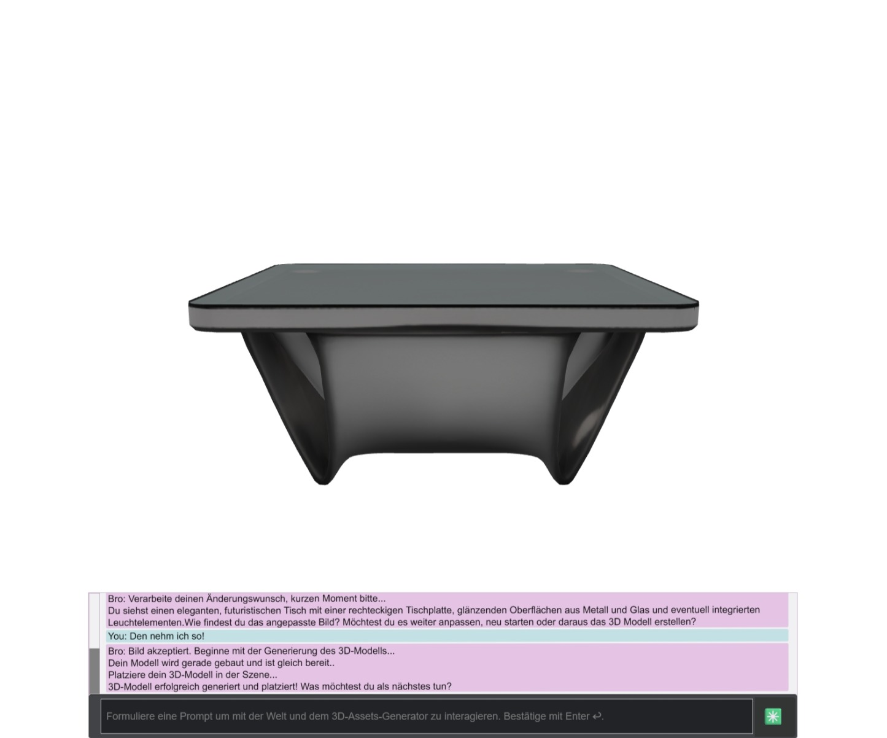

# Text-zu-3D

Diese Repository enthält Materialien und Ergebnisse zur Studienarbeit "Text-zu-3D - Interaktion mit universellen Szenenbeschreibungen". Die Arbeit befasst sich mit der Erstellung dreidimensionaler Modelle und Szenen auf Basis von Textbeschreibungen durch Menschen
und deren Verarbeitung mithilfe moderne KI-Technologien.

*Weiteres ist entsprechend in der Studienarbeit dokumentiert.*

*Die 3D-Modelle aus der Evaluation von Inferenzmodellen sind nicht optimiert und daher recht groß.*  
*Deren Größe scheinen mir gerade irgendwie *